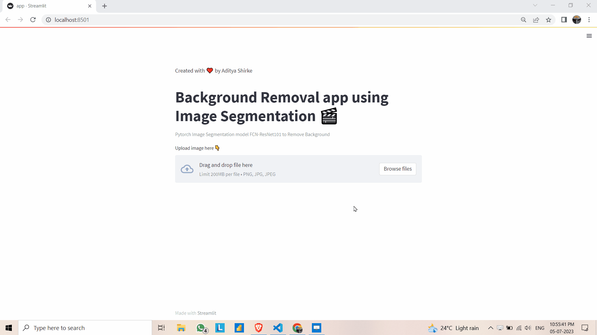

# Background Removal using Image Segmentation

This repository contains an application that utilizes the FCN-ResNet101 model for background removal using image segmentation. It allows you to remove the background from an uploaded image and display the result.

## Demo



## Model

The model used in this application is FCN-ResNet101, which is a combination of two powerful deep learning architectures: Fully Convolutional Networks (FCNs) and ResNet-101. FCN-ResNet101 achieves state-of-the-art performance in semantic segmentation tasks by leveraging the dense pixel-wise prediction capability of FCNs and the feature extraction capabilities of ResNet-101.

The model has been pre-trained on the COCO dataset with VOC labels, which includes 21 categories such as aeroplane, bicycle, boat, and more. By using this model, the application can classify and label objects and regions within an image at the pixel level.

## Code

The code is written in Python and utilizes the following libraries:

- Streamlit: Used for building the interactive web application.
- Torch and torchvision: Provides the FCN-ResNet101 model, along with pre-processing and visualization functions for image segmentation tasks.
- PIL (Python Imaging Library): Used for image manipulation and conversion.
- NumPy: Required for various array operations.

The application loads the pre-trained FCN-ResNet101 model and allows you to upload an image. Once an image is uploaded, the model makes predictions on the image and removes the background. The resulting image is displayed alongside the original image.

### Installation

To set up the necessary dependencies, run the following command to install them:

    ```shell
pip install -r requirements.txt

### Usage

    ```shell
streamlit run app.py

- The application will start, and you can access it through your browser at http://localhost:8501.

- Upload an image: Click on the "Upload image here" button and select an image file (PNG, JPG, or JPEG).

- Background removal: The application will process the image using the FCN-ResNet101 model and remove the background, generating an image without the background.

- View the results: The original image and the image without the background will be displayed side by side.

Feel free to customize and extend the application based on your specific requirements.


